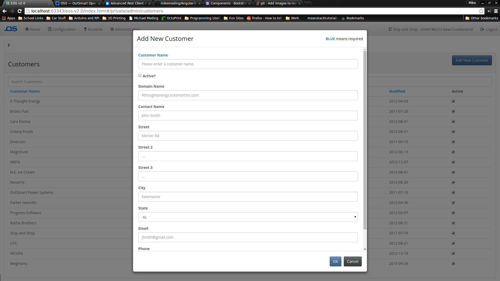

# AnBoMoFo (Angular Bootstrap Modal Forms)
A simple, ultra-lightweight AngularJS service which automatically generates data forms with callbacks using a simple JSON model.

# Live Example
A basic plunker example of this library is now available <a href="http://embed.plnkr.co/ETaJ3W/preview" target="_blank">here</a>

# Installation

The only project requirements are AngularJS, AngularBootstrapUI, and UIRouter.

#### Install with Bower
```sh
$ bower install anbomofo
```

### Adding dependency to your project

When bower is done downloading all of the required files all thats left to do is add dependencies on your main AngularJS module.

Add the flavor of javascript file you would like. Minified or unminified based on your project.
```html
<script src="bower_components/anbomofo/anbomofo.min.js"></script>
```

Include AngularJS dependency
```js
angular.module('myModule', ['autoModals']);
```
This was tested to work with the following browsers:
* Chrome
* (I should probobly test this with more browsers)

# Usage


### Knowledge Requirements
* A good working knowledge of [Angular.js](https://angularjs.org/) and its different componenets.
* A firm grasp of how [Bootstrap](http://www.getbootstrap.com) works. Particularly what modals are and how they work.
* Knowing how to write JSON is also helpful.

## Brief Overview

### Why?

When designing a [Angular.js](https://angularjs.org/) application that handles an abundance of form data it can quickly become unmanageable. If you are like me and have a bunch of forms that only differ by a fiew fields it can be infuriating to have to write two separate form templates each with their own set of control methods. This becomes even more of a nightmare when you have 20+ different forms that each have to be collected and updated from a database. In comes this handy library! Angular-Data-Driven-Modals allows you to specify only what the data looks like and like magic you get both a means of adding and updating your data in convient [Bootstrap](http://www.getbootstrap.com) modal forms.

### Basic procedure

* Include this library as a part of your project (Described above)
* Add this library as a dependency to your project (Described above)
* Define a model in this service and allow access to it through a getModel() function
* Define a submit method in this service to gain access to the outgoing data
* Compile your model using the compileModel() method
* Attach the modal to an object in your DOM and PRESTO!

         
## Include Service
To implement your own data driven modal you need to have a service to support it. The structure of which is as follows,
         
## Model Structure
```javascript
var onSubmit = function(obj){
	console.log(obj);
};

var model = {
	// The structure of the input fields
	fields: [
		{name: "id", display: false}, // this item is preserved but not displayed
        // follows a simalar naming patter as the input fields would
		{name: "name", displayName: "Name", placeholder: "Panel [a,b,etc...]", type: "text", required: true},
		{name: "mac", displayName: "MAC", placeholder: "0x36000...", type: "text", required: true},        
        ...
	],
    // Add mode settings
	addModalSettings: {
		title: 'Add New Panel',
        // the submission callback function above. All fields are placed into a new object
		callback: this.onSubmit 
	},
	editModalSettings: {
		...
	}
};

// other getters and setters here
```
         
## Implement Method
```javascript
// this method must be implemented in your angular service
this.getModel = function () {
	return model;
};
```
As AngularJS has no means of creating interfaces as in Java you must remember to implement this method on your own. Its function is straightforward as it simply allows public access to your local model variable.
         
## Compile Model
```javascript
model = ModalService.compileModel(model);
```         

## Attach modal to DOM
```html
<button class="btn btn-primary" modal ng-service="PanelDataService">Add Panel</button>
```
This directive uses the existance of the the ng-model="" attribute as its means of differentiating between a modal that is in add mode and edit mode.

Remember, a basic plunker example of this library is now available <a href="http://embed.plnkr.co/ETaJ3W/preview" target="_blank">here</a>
